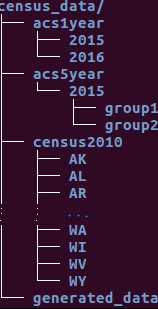

[](https://travis-ci.org/GL-Li/rawcensus2010)

# Extract information from raw census and ACS data

This package provides total solutions to extracts any data from the raw summary files of decennial census and American Community Survey (ACS) and returns a tidy data.table. The extracted data can be easily processed with `data.table` or `dplyr` packages. 


## Why another R census package

The [census API](https://www.census.gov/data/developers/guidance/api-user-guide.Available_Data.html) offers most data in decennial census and America Community Surveys for download and the API-based packages such as `tidycensus`, `censusapi` and `acs` make the downloading very easy in R. So why we need another package?

The selling points of package `totalcensus` include:

- It extracts all data in the summary file 1 with urban/rural update of Census 2010, while the census API only provide data in summary file 1 before urban/rural update.
- It can easily extract the data of all census tracts or blocks of a city or metro, which is a headache for census API based packages.
- It provides longitude and latitude of the internal point of a geographic entity for easy and quick mapping. 

[Examples of extracting data with package totalcensus](????????????????????)


## Installation
Install `devtools` package if you do not have it:  
```r
install.packages("devtools")
```   

Install `totalcensus` package:   
```r
devtools::install_github("GL-Li/totalcensus")
```

## Use the package

### Download raw data (add file structure????????????????????????????)

In order to use this package, the raw data need to be stored in your local computer. The downloaded data must organized in certain directory structures. You can name to top directory whatever you like, for example, census_data, but all its subdirectories must be exactly as specified below.



The 2010 census summary file 1 (with urban/rural update) can be downloaded from [United States Census Bureau official site](https://www2.census.gov/census_2010/04-Summary_File_1/Urban_Rural_Update/). The data is split into sub-folders of 50 states and DC. An additional sub-folder called "National/" holds summary data for the United States. Inside a sub-folder, for example, "Indiana/", there is a file named _in2010.ur1.zip_. Download this file and unzip it to a folder named with Indiana's abbriation, “IN”. Do this for all other states and DC. For the "National/" data, unzip the file to folder "US". You can just download the sub-folders you need. If you want download all of them, make sure you have enough disc space as the total file size is about 140 GB. 

After downloading the data you needed, run function below to set path for all future use of the package.

```r
set_path_to_census("your_path_to_census_data", install = TRUE)
```


### Read census and ACS data
Currently the package provides three functions to read data from summary files of Census 2010, ACS 1-year surveys, ACS 5-year surveys. These function comes with intuitive names: `read_census2010()`, `read_acs1year()`, and `read_acs5year()`. Examples below shows the basic application.

```r
library(totalcensus)
tmp <- read_census2010(state = "IN", 
                       geo_headers = c("PLACE"),
                       table_contents = c("PCT012F139", "H0070016"))
print(tmp)

    #               lon      lat LOGRECNO SUMLEV GEOCOMP PLACE state PCT012F139 H0070016
    #      1: -86.28395 39.90303        1    040      00          IN       1539    42507
    #      2: -86.23489 40.13668        2    040      01          IN       1446    39815
    #      3: -86.21876 40.43883        3    040      04          IN       1257    34693
    #      4: -86.21021 40.12984        4    040      28          IN        189     5122
    #      5: -86.27358 39.92054        5    040      43          IN         93     2692
    #     ---                                                                           
    # 331552: -85.55221 41.63835   331552    970      00          IN          1       19
    # 331553: -87.49205 41.67686   331553    970      00          IN          6      205
    # 331554: -85.66872 41.15086   331554    970      00          IN          0       12
    # 331555: -86.03878 39.35130   331555    970      00          IN          0        0
    # 331556: -87.20929 41.63419   331556    970      00          IN          0        0

```
The data of geographic entities you are interesting in can be further selected from this data.table. As an example, I will show how to select the data of census blocks of South Bend city. South Bend is a PLACE with FIPS code "71000" and the summary level (SUMLEV) code of census block is "100". We can do the selection in `data.table` package or using `dplyr` package.

```r
# using data.table
library(data.table)
tmp[PLACE == "71000" & SUMLEV == "100"]

    #             lon      lat LOGRECNO SUMLEV GEOCOMP PLACE state PCT012F139 H0070016
    #    1: -86.21864 41.63613   241626    100      00 71000    IN         NA        0
    #    2: -86.21659 41.63670   241627    100      00 71000    IN         NA        0
    #    3: -86.22172 41.63573   241628    100      00 71000    IN         NA        0
    #    4: -86.22022 41.63182   241629    100      00 71000    IN         NA        2
    #    5: -86.22093 41.63367   241630    100      00 71000    IN         NA        0
    #   ---                                                                           
    # 5002: -86.25132 41.69486   252566    100      00 71000    IN         NA        0
    # 5003: -86.25815 41.69649   252567    100      00 71000    IN         NA        0
    # 5004: -86.35508 41.73058   253091    100      00 71000    IN         NA        0
    # 5005: -86.35565 41.73035   253092    100      00 71000    IN         NA        0
    # 5006: -86.35573 41.72831   253093    100      00 71000    IN         NA        0

# or using dplyr to get the same result
library(dplyr)
filter(tmp, PLACE == "71000" & SUMLEV == "100")
```

### search the codes
In the above example, many special codes and references are used in census data. Strings of upper case letters are for geographic headers, strings of mixed uppder case letters and numbers for table contents, strings of integers for summary level (SUMLEV), geographic components (GEOCOMP) and FIPS numbers of place (PLACE) and county subdivision (COUSUB). There are many more other codes and references; they are nightmare for census data users.

The _rawcensus2010_ package provides a few functions to search for these codes. These functions are named as `search_xxxx()`. In above example, we used PLACE FIPS code and summary level code to select rows of census blocks of South Bend. The search functions can help to find the codes, as shown blow.

```r
# find the FIPS code of South Bend. PLACE == "71000" is for South Bend in Indiana
search_fips("indiana south bend")

    #    state_full state STATE SUMLEV COUNTY COUSUB PLACE CONCIT            NAME
    # 1:    Indiana    IN    18    162    000  00000 71000  00000 South Bend city
    
# find summary level code of census block. The third is the census block with code "100"
search_sumlev("block")

    #                                                                                       summary_level code
    # 1:                         State-County-County Subdivision-Place/Remainder-Census Tract-Block Group  091
    # 2:             State-County-County Subdivision-Place/Remainder-Census Tract-Block Group-Urban/Rural  090
    # 3:       State-County-County Subdivision-Place/Remainder-Census Tract-Block Group-Urban/Rural-Block  100
    # 4:                                                            State-County-Census Tract-Block Group  150
    # 5: State-County-Census Tract-Block Group-American Indian Area/Alaska Native Area/Hawaiian Home Land  154
```

The most useful search function is `search_datafile()`, which searchs for table contents to be used in `read_2010census()`. For example, we can search table contents for asian population in prison with `search_datafile("prison asian population")`. In the search results, the references of table contents, "PCT020D005" and "PCT020D006", are for asian population in federal and state prisons respectively. They can be fed to `read_2010census()` as argument `table_contents = c("PCT020D005", "PCT020D006")`. 

```r
search_datafile("prison asian population")

    #    file_segment               table_content  reference table_number                                                     table_name   universe
    # 1:           37 ----- Federal prisons (102) PCT020D005       PCT20D GROUP QUARTERS POPULATION BY GROUP QUARTERS TYPE (ASIAN ALONE)    ... ...
    # 2:           37   ----- State prisons (103) PCT020D006       PCT20D GROUP QUARTERS POPULATION BY GROUP QUARTERS TYPE (ASIAN ALONE)    ... ...
```
