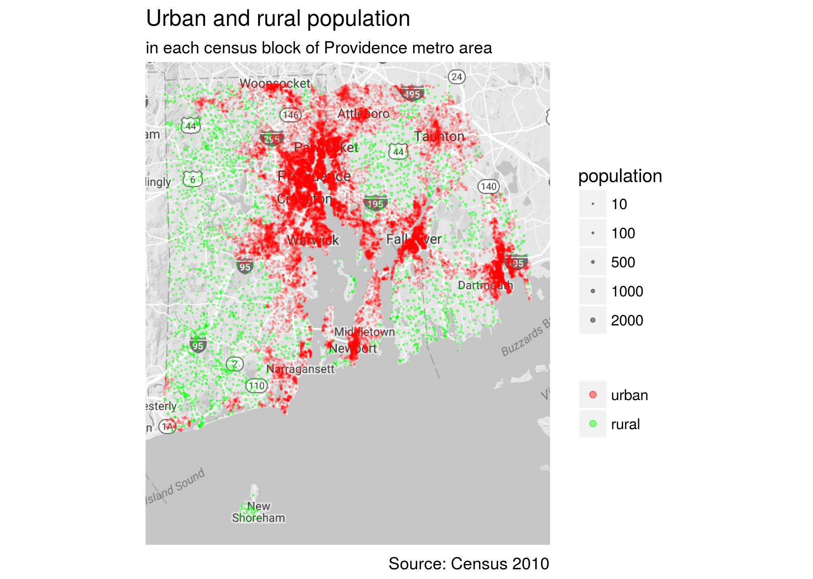
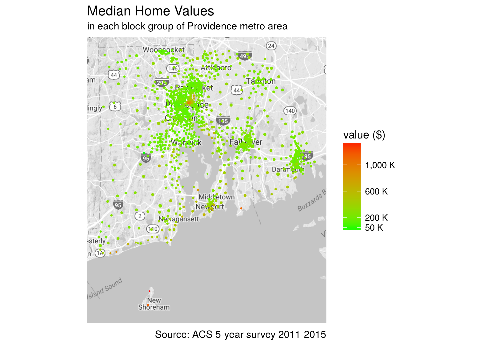

```{r setup, include=FALSE}
knitr::opts_chunk$set(echo = TRUE, eval = FALSE)
```

The census API offers most data in the Census 2010 and America community surveys for download and the API-based packages such as `tidycensus`, `censusapi` and `acs` makes the downloading very easy in R. So why we need another package?

The selling points for the package `totalcensus` include:

- Package `rawcensus2010` extracts all data in the summary file 1 with urban/rural update, while the census API only provide data in summary file 1 before urban/rural update.
- It is straightforward to get data of all census tracts or blocks of a city or metro with package `totalcensus`, while it is a headache if possible with census API based packages.
- Package `totalcensus` provides longitude and latitude of the internal point of a geographic entity for easy and quick mapping. 

Here we will demonstrate these advantages with examples.

### urban/rural update data
The census API does not provide updated data in 2010 census summary file 1 with urban/rural update, for example, if we want to extract urban and rural population of each county in Rhode Island, the census API gives 0, which is the default value in summary file 1 before urban/rural update. Below is the code using census API based package `tidycensus`.

```{r}
library(tidycensus)
# change the api to your own's
census_api_key("ab664ab627f56ed01df0b97a25f6f473598a7fec")

# all urban/rural population are returned as zero.
RI_ur <- get_decennial(state = "RI", geography = "county", 
                       variables = c("P0020002", "P0020005"),
                       year = 2010)

print(RI_ur)

## A tibble: 10 x 4
#    GEOID              NAME variable value
#    <chr>             <chr>    <chr> <dbl>
#  1 44001    Bristol County P0020002     0
#  2 44003       Kent County P0020002     0
#  3 44005    Newport County P0020002     0
#  4 44007 Providence County P0020002     0
#  5 44009 Washington County P0020002     0
#  6 44001    Bristol County P0020005     0
#  7 44003       Kent County P0020005     0
#  8 44005    Newport County P0020005     0
#  9 44007 Providence County P0020005     0
# 10 44009 Washington County P0020005     0
```

These data can be extract easily with `totalcensus`.
```{r}
library(data.table)
library(magrittr)
library(totalcensus)
# change path to your own local folder
RI_ur <- read_decennial(year = 2010,
                        states = "RI", 
                        geo_headers = "COUNTY", 
                        table_contents = c("P0020002", "P0020005"),
                        summary_level = "county",
                        geo_comp = "00") %>%
    setnames(c("P0020002", "P0020005"), c("urban", "rural"))

print(RI_ur)
#                 area       lon      lat COUNTY state population  urban rural GEOCOMP SUMLEV
# 1:    Bristol County -71.28505 41.70527    001    RI      49875  49305   570      00    050
# 2:       Kent County -71.57631 41.67775    003    RI     166158 152888 13270      00    050
# 3:    Newport County -71.28406 41.50273    005    RI      82888  72865 10023      00    050
# 4: Providence County -71.57824 41.87049    007    RI     626667 592145 34522      00    050
# 5: Washington County -71.61761 41.40116    009    RI     126979  87840 39139      00    050
```


## all census tracts or blocks in a city or metro
With `tidycensus` one can download selected variables of all census tracts or blocks of a county, or selected variables of all census tracts of a state. The census API does not have a path from city/metro to census tract/block. It is possible to combine packages `tidycensus` with `tigris` to [extract data of all census tracts of a metro](http://walkerke.github.io/2017/05/tigris-metros/), but it is somehow complicated. 

In `totalrawcensus` we can get the data simply by filtering what we want. For example, we want to get urban and rural population of every block in Providence metro area, which covers Rhode Island and part of Massachusettes.

```{r}
library(totalcensus)
bos <- read_acs5year(
    year = 2015, 
    states =  "MA", 
    table_contents = "B25077_001", # median home value
    areas = "Boston city, MA",
    summary_level = "block group"
)  %>%
    # change column names to readable form
    setnames("B25077_001", "home_value")

# most blocks belongs to urban area as they are in a metro
print(bos) 

```

### quick plot with longitude and latitude data
The above data already include the longitude and latitude of an internal point of every census blocks in Providence metro area. So we can plot urban and rural poulation in this metro area. I like the point plot more than the shape plot as it can be overlaid nicely on a true map.

```{r}
library(ggmap)
library(ggplot2)
bos_map <- get_map("roxbury, MA", zoom = 12, color = "bw")

ggmap(bos_map) + 
    # ylim(41.15, 42) +
    # xlim(-71.8, -70.85) +
    geom_point(data = bos[!is.na(home_value)], aes(lon, lat, size = population, color = home_value)) +
    scale_size_area(max_size = 3) +
    scale_color_continuous(low = "green", high = "red") +
    labs(title = "Median home value in Boston city, MA", 
         subtitle = "in each block group of Boston city",
         caption = "Source: ACS 5-year survey 2011-2015",
         size = "population", color = "home value") +
    theme(axis.title = element_blank(),
          axis.text = element_blank(),
          axis.ticks = element_blank())

ggsave(filename = "why_this_package/prov_urban_rural_population.png")
```



## median home values in each block group in Providence metro
The data is in 2011-2015 ACS 5-year survey.

```{r}
prov_home <- read_acs5year(states = c("MA", "RI"),
                           year = 2015,
                           geo_headers = "CBSA",
                           table_contents = c("B01003_001", "B25077_001"),
                           summary_level = "block_group",
                           with_margin = FALSE) %>%
    .[CBSA == "39300"] %>%
    setnames(c("B01003_001_e", "B25077_001_e"), c("population", "value")) %>%
    # some missing value in home value shown as "." and so the whole column was
    # read into character. change column back to numeric and remove NAs
    .[, value := as.numeric(value)] %>%
    .[!is.na(value)] %>%
    .[order(value)]

prov_map9 <- get_map("warwick, RI", zoom = 9, color = "bw")

ggmap(prov_map9) +
    geom_point(data = prov_home,
               aes(lon, lat, size = population, color = value),
               alpha = 1) +
    ylim(41.15, 42) +
    xlim(-71.8, -70.85) +
    scale_size_area(max_size = 1) +
    scale_color_continuous(low = "green", high = "red",
                           breaks = c(50000, 200000, 600000, 1000000),
                           labels = scales::unit_format("K", 1e-3)) +
    guides(size = FALSE) +
    labs(color = "value ($)",
         caption = "Source: ACS 5-year survey 2011-2015",
         title = "Median Home Values",
         subtitle = "in each block group of Providence metro area") +
    theme(axis.title = element_blank(),
          axis.text = element_blank(),
          axis.ticks = element_blank())

ggsave(file = "why_this_package/prov_home_values.png")
```


