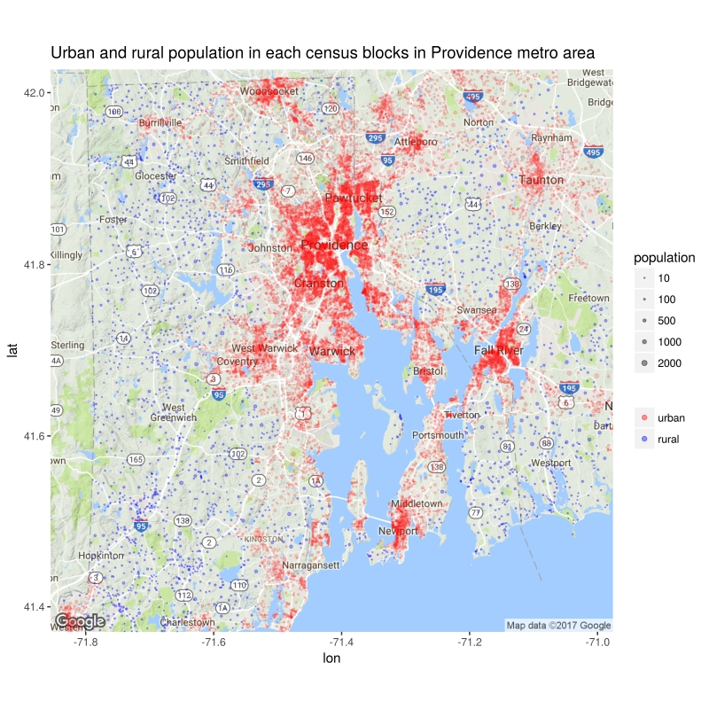

```{r setup, include=FALSE}
knitr::opts_chunk$set(echo = TRUE, eval = FALSE)
```

The census API offers most data in the Census 2010 summary file 1 for download and the API-based packages such as `tidycensus` and `acs` makes the downloading very easy in R. So why we need another package.

The selling points for the package `rawcensus2010` include:

- Package `rawcensus2010` extracts all data in the summary file 1 with urban/rural update, while the census API only provide data in summary file 1 before urban/rural update.
- It is straightforward to get data of all census tracts or blocks of a city or metro with package `rawcensus2010`, while it is a headache if possible with census API based packages.
- Package `rawcensus` provides longitude and latitude of the internal point of a geographic entity for easy and quick mapping. 

Here we will demonstrate these advantages with examples.

### urban/rural update data
The census API does not provide updated data in 2010 census summary file 1 with urban/rural update, for example, if we want to extract urban and rural population of each county in Rhode Island, the census API gives 0, which is the default value inf summary file 1 before urban/rural update. Below is the code using census API based package `tidycensus`.

```{r}
library(tidycensus)
# change the api to your owns
census_api_key("ab664ab627f56ed01df0b97a25f6f473598a7fec")

# all urban/rural population are returned as zero.
RI_ur <- get_decennial(state = "RI", geography = "county", 
                          variables = c("P0020002", "P0020005"),
                          year = 2010)

print(RI_ur)

    ## A tibble: 10 x 4
    #    GEOID              NAME variable value
    #    <chr>             <chr>    <chr> <dbl>
    #  1 44001    Bristol County P0020002     0
    #  2 44003       Kent County P0020002     0
    #  3 44005    Newport County P0020002     0
    #  4 44007 Providence County P0020002     0
    #  5 44009 Washington County P0020002     0
    #  6 44001    Bristol County P0020005     0
    #  7 44003       Kent County P0020005     0
    #  8 44005    Newport County P0020005     0
    #  9 44007 Providence County P0020005     0
    # 10 44009 Washington County P0020005     0
```

These data can be extract easily with `rawcensus2010`.
```{r}
library(data.table)
library(magrittr)
library(rawcensus2010)
# change path to your own local folder
path_to_census <- "~/dropbox_datasets/US_2010_census/"
RI_ur <- read_2010census(path_to_census, "RI", 
                         geoheaders = "NAME", 
                         table_contents = c("P0020002", "P0020005")) %>%
    # filter data with summary level and geographic component
    .[SUMLEV == "050" & GEOCOMP == "00"]

print(RI_ur)
    #    LOGRECNO SUMLEV GEOCOMP              NAME state P0020002 P0020005
    # 1:       49    050      00    Bristol County    RI    49305      570
    # 2:     1327    050      00       Kent County    RI   152888    13270
    # 3:     6060    050      00    Newport County    RI    72865    10023
    # 4:     8943    050      00 Providence County    RI   592145    34522
    # 5:    24262    050      00 Washington County    RI    87840    39139
```


## all census tracts or blocks in a city or metro
With `tidycensus` one can download selected variables of all census tracts or blocks of a county, or selected variables of all census tracts of a state. The census API does not have a path from city/metro to census tract/block. It is possible to combine packages `tidycensus` with `tigris` to [extract data of all census tracts of a metro](http://walkerke.github.io/2017/05/tigris-metros/), but it is somehow complicated. 

In `rawcensus2010` we can get the data simply by filtering what we want. For example, we want to get urban and rural population of every block in Providence metro area, which covers Rhode Island and part of Massachusettes.

```{r}
library(rawcensus2010)
prov <- read_2010census(path_to_census, c("MA", "RI"), 
                        geoheaders =  c("CBSA", "INTPTLON", "INTPTLAT"), 
                        table_contents = c("P0020002", "P0020005")) %>%
    # change column names to readable form
    setnames(c("INTPTLON", "INTPTLAT", "P0020002", "P0020005"), 
             c("lon", "lat", "urban", "rural")) %>%
    # filtering with CBSA code, summary level, and geographic component
    .[CBSA == "39300" & SUMLEV == "100" & GEOCOMP == "00"] %>%
    # remove blocks no people lives in
    .[urban != 0 | rural != 0]

# most blocks belongs to urban area as they are in a metro
print(prov) 
    #        LOGRECNO SUMLEV GEOCOMP  CBSA       lon      lat state urban rural
    #     1:    22106    100      00 39300 -70.90012 41.68041    MA   199     0
    #     2:    22107    100      00 39300 -70.89773 41.68194    MA    22     0
    #     3:    22108    100      00 39300 -70.89743 41.68116    MA    22     0
    #     4:    22109    100      00 39300 -70.90386 41.67836    MA    15     0
    #     5:    22110    100      00 39300 -70.90364 41.68245    MA    81     0
    #    ---                                                                   
    # 25568:    29028    100      00 39300 -71.78918 41.33623    RI     8     0
    # 25569:    29029    100      00 39300 -71.79403 41.33582    RI    25     0
    # 25570:    29030    100      00 39300 -71.79122 41.33609    RI    27     0
    # 25571:    29032    100      00 39300 -71.78897 41.33288    RI     4     0
    # 25572:    29037    100      00 39300 -71.79308 41.33639    RI    18     0
```

### quick plot with longitude and latitude data
The above data already include the longitude and latitude of an internal point of every census blocks in Providence metro area. So we can plot urban and rural poulation in this metro area. I like the point plot more than the shape plot as it can be overlaid nicely on a true map.

```{r}
library(ggmap)
library(ggplot2)
prov_map <- get_map("warwick, RI", zoom = 10)
ggmap(prov_map) + 
    geom_point(data = prov[urban != 0], aes(lon, lat, size = urban, color = "red"), alpha = 0.15) +
    geom_point(data = prov[rural != 0], aes(lon, lat, size = rural, color = "blue"), alpha = 0.3) +
    scale_color_identity(guide = "legend", breaks = c("red", "blue"), label = c("urban", "rural")) +
    scale_size_area(max_size = 2, breaks = c(10, 100, 500, 1000, 2000)) +
    labs(title = "Urban and rural population in each census blocks in Providence metro area", 
         size = "population", color = NULL)
```


